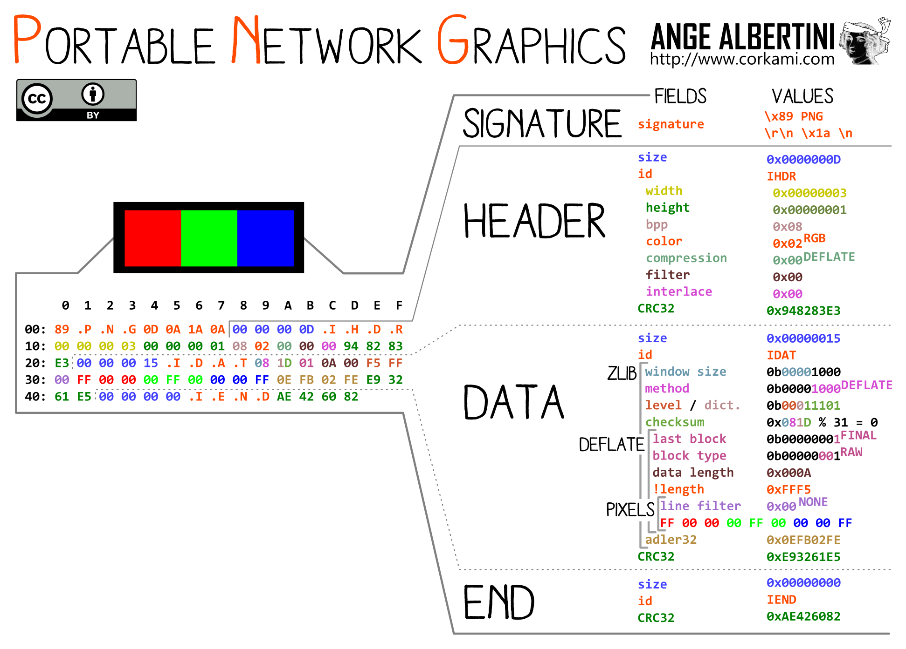
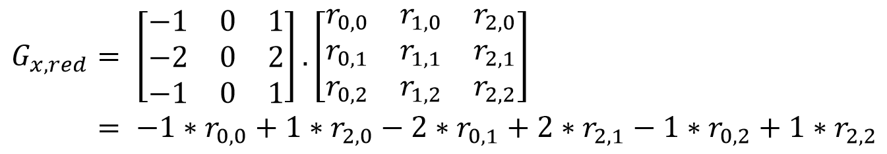
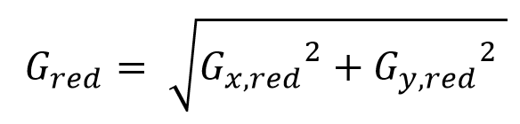
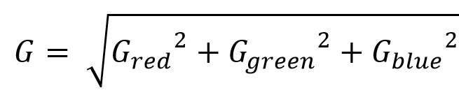

# Lab0x01 Instructions - Code Review and Unit Tests

Submission deadlines:
- Final: 16th March 2023 - 22:59:59 CET

This lab consists of two parts:
- Review source code and find bugs
- Familiarize with unit tests both for functionality and edge cases

## Grading

The lab is graded over 30 points with the subsequent division, each explained in
detail in its corresponding section.
- 20 points for bug finding
- 10 points for unit tests

Make sure **all** source files you submit are formatted using `clang-format` and
LLVM style (`--style=LLVM`) before submission.  `clang-format` can be obtained
on Ubuntu by installing the package `apt install clang-format`.

**Code that isn't linted/formatted properly or does not compile successfully
will incur a penalty ranging from 5 points up to the full grade**

# Submission Instructions

Please submit a zip file `<sciper>.zip` within the deadline (generate it by
running `zip -r <sciper>.zip reports src`), an example valid `<sciper>` is
`123456`.

The code needed for this assignment is provided as an archive with a single
top-level directory, `src/`.
1. Extract the archive
2. Apply your fixes directly in `src/`
3. Add a new sibling directory, `reports/`
4. For every discovered bug, save a file, named `bug_X_Y.md`, where X is the
   filename where you located the bug and Y is a bug identifier
   (e.g., decimal numbers starting at 0).
5. Create a new zip archive with the two top-level directories, `src/` and
   `reports/` and upload it to the assigned submission form on Moodle.

Please follow the following checklist before submission. Do not leave it till
the last minute.
- The folder structure should be EXACTLY as provided (see below)
- No source file names should be modified
- Remove all compiled/generated `.o`,`.a` files and executables (`make clean` should
  do this job for you)
- Remove all unnecessary files (e.g., source_file.bak.v1)

```
<sciper>.zip
├── reports
│   └── bug_*.md
└── src
    ├── *.[c|h]
    └── test_imgs
        └── *.png
```

We would like to particularly stress on having the correct folder structure.
Inability to find the correct folder to be graded massively increases TA effort.
We would rather spend the time helping you with constructive feedback.  To
enforce this rule, we will penalize submissions that do not follow the rules
above.

If you have any doubts, don't hesitate to contact with the TA team earlier
rather than later.

# Y0L0 PNG library
## Utility Programs Description

Several programs have been implemented to showcase the capabilities of the Y0L0
PNG format:

- `checkerboard`
- `circle`
- `epfl`
- `filter`
- `rect`
- `resize`
- `solid`

### Solid

Usage: `solid output_file height width hex_color`

Output: A PNG file consisting of a solid block of color.

### Checkerboard

Usage: `checkerboard output_file height width square_width hex_color1
hex_color2`

Output: A PNG file consisting of squares of alternating colors.

### Filter

Usage: `filter input_file output_file filter_name [filter_arg]`

Output: Processes the input image using the specified filter.

#### Grayscale

Usage: `filter input_file output_file grayscale`

Output: The grayscale version of the input image.

#### Negative

Usage: `filter input_file output_file negative`

Output: The negative version of the input image.

#### Blur

Usage: `filter input_file output_file blur blur_radius`

Output: The blurred version of the image where every pixel is replaced by an
average value of its neighborhood.

#### Specific_color

Usage: `filter input_file output_file specific_color hex_color`

Output: Sets the alpha channel of every pixel which are not `hex_color` to transparent.

### Circle

Usage: `circle input_file output_file center_x center_y radius hex_color`

Output: Draws a specified circular line over the input image.

### Rect

Usage: `rect input_file output_file top_left_x top_left_y bottom_right_x
bottom_right_y hex_color`

Output: Draws the specified rectangle over an input image.

### EPFL
Usage: `epfl input_file output_file top_left_x top_left_y size hex_color`

Output: Draws the EPFL logo in any color (please choose `#fe0002`) over the input image.

### Resize Image

Usage: `resize input_file output_file float_factor`

Output: Resizes the input by the specified factor.

## Building

The PNG Parser library can be built by running `make libpngparser`. It depends
on zlib for compression and on common build tools for building. On Ubuntu,
install the `zlib1g-dev` and `build-essential` packages, respectively.

Utility programs can be compiled by running `make program_name` or `make all`.
Since the latter command also compiles the [unit tests](#unit-tests), you might
need to install the `check` package used in the unit tests as well.

## Y0L0 PNG Format

Y0L0 PNG format is a subset of the PNG file format. It consists of a PNG file
signature, followed by mandatory PNG chunks:

- IHDR chunk
- Optional PLTE chunk
- One or more IDAT chunks
- IEND chunk

All multibyte data chunk fields are stored in the big-endian order (e.g. 4-byte
integers, CRC checksums). IHDR must follow the file signature. If the palette is
used to denote color, PLTE chunk must appear before IDAT chunks. IDAT chunks
must appear in an uninterrupted sequence. The image data is the concatenation of
the data stored in all IDAT chunks. IEND must be the last chunk in an image. All
other chunk types are simply ignored.



PNG files from the web or generated by *real* programs (e.g., screenshot) will
usually not work with this library. You should be able to generate example PNG
files with the `solid` or `checkerboard` program.

### Y0L0 PNG File Signature

Y0L0 PNG files start with the byte sequence: `137 80 78 71 13 10 26 10`

### Y0L0 PNG Chunks

Y0L0 PNG chunks have the following structure:

- Length (4 bytes) denotes the length of the data stored in the chunk
- Chunk type (4 bytes) identifies the chunk type (IHDR, PLTE, IDAT or IEND). The
  type is encoded as a 4 byte sequence.
- Chunk data (Length bytes) stores the actual chunk data
- CRC code (4 bytes) is a checkcode that is calculated over chunk type and chunk
  data

All fields are consecutive and in the given order.


#### IHDR Chunk

IHDR chunk must appear as the first chunk following the file signature. It has
the type `IHDR` and the following structure of the chunk data:

- Width (4 bytes)
- Height (4 bytes)
- Bit depth (1 byte)
- Color type (1 byte)
- Compression method (1 byte)
- Reserved (2 bytes)

All fields are consecutive and in the given order.

##### Bit Depth

The only supported bit-depth is 8 bits (1 byte). This refers to 1 byte per color
channel in the RGBA color mode, and to 1 byte per palette index in PLTE color
mode.

##### Color Type

Color type field denotes the way color data is stored in the image. The only
supported values are 3 (palette) and 6 (RGBA).

- Palette denotes that we expect to find a PLTE chunk in the image. In the IDAT
  chunk data colors are not represented as RGBA tuples, but as indices in the
  palette table. Every offset has the length of bit-depth. If the pixel has the
  color of 0x123456, and the palette has the color {R:0x12, G:0x34, B: 0x56} at
  the position 5, the value 5 will be stored in the image.
- RGBA mode represents colors in IDAT data as a sequence of 4 values per pixel,
  each one bit-depth in size. Every value corresponds to the intensity of a RGBA
  (red-green-blue-alpha) channel.

##### Compression Method

The only supported compression method is the deflate algorithm signified by
value 0.

##### Reserved

Reserved for future use.

#### PLTE Chunk

PLTE chunk must appear before the IDAT chunk if the palette is used to encode
color. Its type is encoded with `PLTE`. The chunk data is an array of PLTE
entries which are defined as:

- Red (1 byte)
- Green (1 byte)
- Blue (1 byte)

The length field of the PLTE chunk needs to be divisible by 3.

#### IDAT Chunk

The type of the IDAT chunk is encoded by the bytes `IDAT`. If multiple IDAT
chunks exist, they must all occur in sequence.  The image data is the
concatenation of the data stored in all the IDAT chunks in the order in which
they appeared. It is compressed using the deflate algorithm and is stored in the
zlib file format:

- Compression type and flags (1 byte)
- Flags and check bits (1 byte)
- Compressed data (n bytes)
- Adler-32 checksum (4 bytes)

This data is used as an input for the inflate algorithm and is handled by
zlib. Inflated data is stored left-to-right, top-to-bottom. Every row (scanline)
begins with a byte denoting the start of the line. This byte must be 0. Pixel
information for the scanline follows this byte. It consists either of the
palette index (1 byte), or of the RGBA pixel value (4 bytes), depending on the
color format.

All fields of structures are consecutive and in the given order.

#### IEND Chunk

IEND chunk appears as the last chunk in the file. Its type is `IEND`. It stores
no data and the length field is 0.


## PNG Parser Interface

PNG Parser interface consists of functions:

- `int load_png(char *filename, struct image ** img)` loads a png file denoted
  by the filename and writes a pointer to struct image into the memory pointed
  to by img. Please remember to free both img and img->px after you are finished
  using the image. Also remember to do it in the correct order. This function
  returns 0 on success and a non-zero value on failure.
 
- `int store_png(char *filename, struct image *img, struct pixel *palette,
  unsigned palette_length)` which stores an image into the file. If the palette
  argument is NULL, the image is stored in the RGBA format. Otherwise, the
  palette is used to index colors.

- `struct image` stores the height and the width of an image, as well as a
  flattened array of pixels.

```
struct image {
    uint16_t size_x;
    uint16_t size_y;
    struct pixel *px;
};
```

- `struct pixel` represents a pixel as a RGBA tuple.
```
struct pixel {
    uint8_t red;
    uint8_t green;
    uint8_t blue;
    uint8_t alpha;
};
```

# Code Review
## Bugs and Fixes

In this lab, your task is to review the code in order to find bugs, trigger them,
and write the fixes for these bugs. There are at least 20 bugs but less than 25.

We do not look only for bugs that can clearly end up in a crash
(e.g., `SIGSEGV`), but which diverts from the program's design. Consider that
there may be bugs that don't seem exploitable at first impression, but that
without much difficulty can suppose a threat.

### Finding Bugs

1. Go through the code and identify locations where faulty behavior can occur.
2. For each identified location, create a test case that triggers the bug. A test case is usually composed of a test image and a shell command involving this image.
3. File a bug report for each bug, following the sample file `bug_PROGRAM-NAME_0.md`.

Only bugs in the following files will count towards the grade in this lab:

- `checkerboard.c`
- `circle.c`
- `filter.c`
- `rect.c`
- `epfl.c`
- `resize.c`
- `solid.c`

However, any bugs found in the PNG parsing library (`pngparser.c`) do **NOT**
count but may come in useful later in the course.  Example bugs will not be
graded, but students are encouraged to fix them on their own.

### Fixing Bugs

For each discovered bug, identify the culprit (e.g., uninitialized variable),
and replace it with code that produces results which match the expected behavior.
Expected behavior can be inferred from the description of different functions
and tools. Exercise common sense and write the simplest fix you can think of for
each bug.

**Your fixes will be verified for functionality.**

## Grading

For each bug, we will evaluate the effectiveness of the patch that you submit
and a bug report.
We classify the bugs in 13 categories and each category is worth 2 points.
Fully solving 10 categories should therefore be enough to obtain the maximum
grade.
While extra categories won't count towards the grade directly, they will be
taken into consideration.
There are categories with only a single bug, but there are also categories with
multiple bugs.
In case you don't find all bugs in a category, your grade for that category
will be proportional to `bugs_found`/`(bugs_found+1)`.
If all bugs are discovered, you will receive the full points for the
corresponding category.

The categories are as follows:

- Unchecked return code from system call
- Stack buffer overflow/underflow
- Command injection
- Arithmetic overflow/underflow
- Heap overflow/underflow
- Temporal safety violation
- Local persisting pointers
- String vulnerability
- Iteration errors
- Wrong operators/variables
- Type error
- Memory leak
- Logic error: where the program behavior explicitly deviates from the behavior described in the comments

Any bug outside of the previous categories may count if the teaching staff
considers it so.

# Unit Tests

Unit testing is a form of testing that focuses on testing 'small' regions of
code extensively. This is often part of a code development strategy known as
Test-driven development.

As opposed to end-to-end testing (which treats the program as a black-box and
looks at the final outputs for test inputs), unit testing generally follows a
white-box approach. Thus, unit tests are able to run small snippets of code, and
deeply inspect program state. For example, unit tests are able to read and check
state within data structures and objects. When testing a single function,
unit-testing also allows testing of obscure paths which might be harder to
trigger in an end-to-end test. However, unit-testing is not an exhaustive
approach and is only as complete as the number of edge-cases that the programmer
can envision and implement tests for.

The exact use of unit-tests depends on the requirements of the program being
tested, but typically includes tests for functionality on known, simple inputs
and outputs, and tests for corner cases and errors.
The functionality tests also allow the programmer to check when program
behavior deviates from expected behavior, and thus, to debug their programs.
This is where unit testing fits into the development <=> testing cycle. The
tests for corner cases and errors are used to check for bugs on the error
handling paths.

You have to implement unit-tests for the 4 existing filters (consider that the
given implementation may be faulty). You are also required to implement another
filter, for which we provide the unit tests.

## Check: The unit testing framework

In this lab, we shall use the [Check unit testing framework](https://libcheck.github.io/check/) for C. The framework allows the user to
define tests within `START_TEST` and `END_TEST` macros. Within each test, checks
are implemented by `ck_assert_*()` function calls. An example test for a
function implementing addition of two integers might look like this:

```C
START_TEST(addition_test) {
  /* Testing equality between two integers */
  ck_assert_int_eq(sum(1, 2), 1 + 2);

  /* Test inequality between two integers */
  ck_assert_int_gt(sum(1, 2), 2);
}
END_TEST
```

An example output for a unit test run is shown below. Note that of four tests,
only one passed. The failed tests have failed for 3 different reasons.
`failed_test` failed an equality check on line 11 (depends on program logic).
`crashing_test` generated a SEGFAULT. `timeout_test` timed-out after the default
timeout of 4 seconds (see CK_DEFAULT_TIMEOUT).

```
Running suite(s): Example testsuite
25%: Checks: 4, Failures: 1, Errors: 2
tests.c:6:P:Example tests:successful_test:0: Passed
tests.c:11:F:Example tests:failed_test:0: Assertion 'fancy_sum(1u, 2u) == 1u + 2u' failed: fancy_sum(1u, 2u) == 3221342974, 1u + 2u == 3
tests.c:15:E:Example tests:crashing_test:0: (after this point) Received signal 11 (Segmentation fault)
tests.c:20:E:Example tests:timeout_test:0: (after this point) Test timeout expired
```

You will find more example tests implemented in the file `tests.c`. You will
also have to add more tests at the locations marked `TODO`.

> You can install `check` using the command `apt install check` on Ubuntu.

## Writing unit tests

One of your tasks is to implement tests for existing filters. There is a total of seven tests to implement.

### Unit test for negative filter: functionality

Generate a black image of random size (both dimensions in range `[1,127]`), with all alpha
channels set to `128`. Run the negative filter, checking that all pixels are
white. Also check that the alpha channel is untouched.

Run the negative filter again to check that the image is now all black with the
same transparency.

> Note: do not forget to initialize the random number generator before
> generating any random values.

### Unit tests for negative filter: edge case

Generate a `0x0` image, and run the negative filter. This test checks that the
filter does not crash on this input.

### Unit test for blur filter: functionality

For the given image, check that the output of the blur filter is correct over
different values of the radius: `0`, `1`, `2`, and `3`. You might want to
duplicate the given image using the `duplicate_img` function and run the tests
on the duplicated image. For each blur radius, check each pixel.

For radius 0, the image does not change. With pixels `dark0 = {28, 28, 28,
255}`, `dark1 = {42, 42, 42, 255}`, and `dark2 = {63, 63, 63, 255}`, the
expected output for radius 1 is:

```
dark2 dark1 dark2
dark1 dark0 dark1
dark2 dark1 dark2
```

For larger radii, all pixels should be `dark0`.

### Unit test for blur filter: edge case

Generate a random image, and run the blur filter on it with a variety of
radii. A random image is generated in `main`. Setup the `blur_radii` array to
hold the required radii: `{INT_MIN, INT_MAX, 0, image_width, image_height}`
along with all of these divided by `2`, and all of these `+- 1`.  Duplicate the
image before running the filter on the duplicates.

Overall, there will be `5 * 4` calls to the blur filter.

> Note: We know that not all of these make sense. For example, `INT_MAX + 1`, or
  `0 / 2`. Please implement them nonetheless.

### Unit test for specific color filter: functionality

Generate a random image and two random colors. Change the pixel of half the image to one color and the other half to the other color. Apply the filter for one color and check that the transparency was properly set to all pixels of the specific color.

### Unit test for specific color filter: edge case

Call the transparency filter with a `nullptr` for the image. This test should
cause a segmentation fault. This is an example of a test which exposes a bug in
the code. In a usual scenario, this would lead to the developer triaging and
fixing the bug in the library. For this lab, you are not expected to do this.

Remember: this test is not meant to pass. You should **not** have all test pass.

### Unit test for grayscale filter: functionality

There is one implemented test for grayscale functionality:
`grayscale_functionality`. You are required to implement another
`grayscale_examples`.

For this test, you are required to run the grayscale filter with defined weights
on the inputs defined in `grayscale_sources`, and compare them to the outputs
defined in `grayscale_output`. This test loops over a set of inputs, similar to
`edge_example_image`. The alpha channel should not be affected.

You will also need to add this test to `main` in the position indicated.  You
can look at other tests for the syntax for `tcase_add_loop_test`.

> Note: For tests using `tcase_add_loop_test`, there is an implicitly defined
> variable `_i` which is the iteration of the test.


### Unit test for grayscale filter: edge cases

There is already one implemented test for grayscale edge cases:
`grayscale_double_limit`. No further work necessary.


## Additional filters

In this lab, you will be required to implement an additional edge-detection
filter: Detects edges in the image by looking for sudden changes in color
between neighboring pixels.

You will find unit tests for this filter in `tests.c`. Your implementation must
pass these tests.

### Edge detection filter

The edge detection algorithm works by calculating a gradient at each pixel based
on how much the values of the colors change across each axis. For each pixel,
the gradient depends on the neighboring pixels.

You are required to calculate gradients per pixel, per axis `(x,y)`, per color.
The gradients are calculated as the convolution of predefined matrices `G_x` and
`G_y`. For example, for the pixel at `(1,1)`, the gradient for red is:



Next, the gradient per channel are calculated.



Finally, the net gradient is calculated and compared with the threshold. A
gradient larger than the threshold denotes an edge, and the pixel is colored
black, otherwise white. The threshold is represented as a `uint8_t` and should
be cast to `double` before comparison. All intermediate gradients computed
should use double.  The transparency of the pixel is not affected.



> Note: Use `double` for all gradients (`G_red`, `G_green`, `G_blue` and `G`)
  and subgradients (`G_x,red`).  The final comparison will be against
  `threshold` typecast to `double`. This part is not particularly important for
  the filter, but allows us to give you a clear spec against which to run the
  test.

> Note: When calculating gradients for pixels on the edge, the above formula
  requires values for pixels which are outside the image. For these pixels,
  bound the index within the range [0, `size_x` or `size_y`). For example,
  `px[-1][-1]` will be replaced by `px[0][0]`, `px[3][-1]` will be replaced by
  `px[3][0]` and `px[-1][4]` will be replaced by `px[0][4]`.

## Common gotchas

The behavior of `Check` depends on an environment variable `CK_FORK`. If this
variable is `yes` or undefined, Check forks before running each tests, thereby
running each test in a different process.  This allows each test to be
independent, and bugs in one test do not affect other tests. This means that
when trying to debug `tests` with `gdb`, you will see the below output. Despite
setting a breakpoint, you might see that the breakpoint is never hit. This is
because `gdb` continues debugging the parent process by default on a fork, while
the actual tests run in children.

```
(gdb) b tests.c:521
Breakpoint 1 at 0x6ee9: file tests.c, line 521.
(gdb) r
Starting program: /home/user/cs412/SoftSec/lab0x01/expected/tests 
[Thread debugging using libthread_db enabled]
Using host libthread_db library "/lib/x86_64-linux-gnu/libthread_db.so.1".
Running suite(s): lib-Y0l0 tests
[Detaching after fork from child process 6645]
[Detaching after fork from child process 6646]
[Detaching after fork from child process 6647]
[Detaching after fork from child process 6648]
[Detaching after fork from child process 6649]
...
```

To debug tests with `gdb`, either set the environment variable `CK_FORK` to
`no`. You can do this from within `gdb` by running the command `set env
CK_FORK=no`. This has the advantage that all your tests run in one process and
your breakpoints will be hit. However, this can lead to bugs from one test
affecting other tests. Specially for bugs involving the memory allocator
(`malloc`/`free` et al.) these bugs can get really difficult to find/debug.

The other option is to ask `gdb` to follow the child on a fork. This can be done
with the command `set follow-fork-mode child`. This must be done just before the
test which you want to debug.

Example script:
```
file tests

break fork
ignore 1 2
commands
set follow-fork-mode child
info proc
catch syscall clone
end

run

commands 2
info proc
break grayscale_double_limit
break negative_zero_size
break edge_threshold
break transparency_edge_case
break grayscale_functionality
break negative_functionality
break blur_functionality
break transparency_functionality
break edge_checkerboard
break edge_example_image
break blur_radius_edge_cases
continue
end

continue
```

In this script, we set a breakpoint on `libc`'s `fork` function, and `ignore` the
first 2 times we encounter it.  Tailor this number to get to the correct test.
This breakpoint also runs some commands when hit, which we will discuss later.

> Note: At this point, the `fork` breakpoint has not been hit, and its commands
> have not been executed.

Then, we issue the `run` command, which starts executing the `tests` executable.

When it hits the breakpoint, `gdb` runs the commands set on `fork` breakpoint.
Let us take a better look at what these commands were:
- it changes `gdb`'s forking mode to debug the child.
- `info proc` shows that we are still running in the parent.
- sets a catchpoint, which is used to stop just before the `clone` syscall.

At this point, we have a catchpoint (also breakpoint 2) and we can set commands
for it.  The `commands 2` block shows these. We'll ignore them for a bit.

The final `continue` command tells `gdb` to resume execution.  This will continue until
it hits the catchpoint, and executes the commands we set up earlier:
- sets up breakpoints for all tests (you can shorten this list, only breaking on
  the particular test you are interested in)
- `continue` command, which resumes execution after the catchpoint

`gdb` continues after the catchpoint. The syscall causes a child process to be
spawned, which `gdb` follows.  The child eventually executes a test, and the
corresponding breakpoint is hit.

## Grading

The correct implementation of the edge filter will be worth 3 points, and the
implementation of the rest of the unit tests will count 1 point each.

